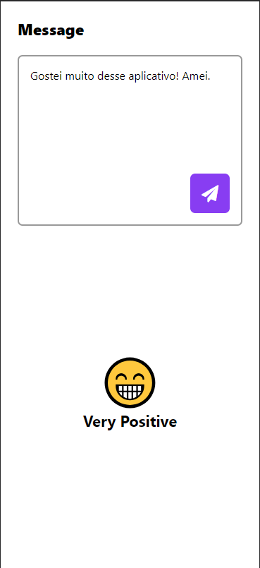

# Sentiment Analysis App

The Sentiment Analysis App is a React Native application that allows users to input a message and check the sentiment associated with that message.



## Inspired by Rocketseat

This project was inspired by a video tutorial from Rocketseat, a programming teaching platform. We thank Rocketseat for the inspiration and learning provided by the tutorial.

## Functionalities

- **Sentiment Analysis**: The application sends the message entered by the user to a sentiment analysis service and displays the result, as "Very Positive", "Positive", "Negative", "Very Negative", "No Polarity" or "Neutral".

## Prerequisites

Before you begin, make sure you meet the following requirements:

- [Node.js](https://nodejs.org/) and [npm](https://www.npmjs.com/) installed
- [Expo CLI](https://docs.expo.dev/get-started/installation/) installed globally
- A sentiment analysis service API key. You can get a free key from [MeaningCloud](https://www.meaningcloud.com/developer/sentiment-analysis)

## Settings

1. Clone the repository:

    ```bash
    git clone https://github.com/guifelippe/sentiment-analysis-reactnative.git

2. Access the project directory:

    ```bash
    cd sentiment-analysis-reactnative

3. Create a env.js file in the project root and add your MeaningCloud API key:

    ```makefile
    API_KEY = YOUR_API_KEY

4. Install project dependencies:

    ```bash
    npm install

## Use

1. Launch the application:

    ```bash
    expo start

2. Use the app on your mobile device or emulator to enter messages and check associated sentiments.

## License

This project is licensed under the terms of the MIT License. See the [LICENSE](LICENSE) file for more information.
